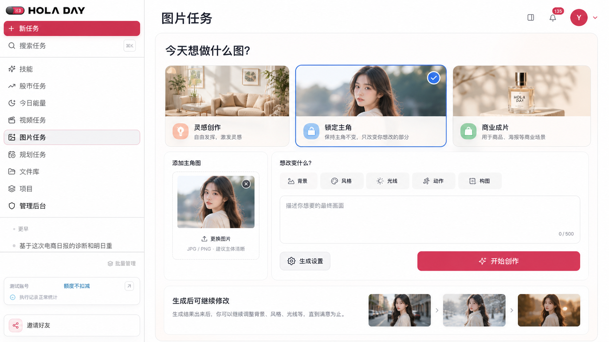

# HOLA DAY 图片创作工作台设计规格

## 1. 决策与定位

本轮选择“场景化图片创作工作台”方案。图片任务不再以模型、比例和数量作为首屏主叙事，而是先让用户知道 HOLA DAY 能完成哪类图片工作，再把现有生成能力组织成一个可持续修改的创作闭环：

> 选择创作目标 → 放入主角或参考图 → 说明想改变什么 → 生成 → 围绕结果继续创作。

本轮选定的视觉目标如下：



视觉稿用于确定信息架构、层级、配色和核心交互。实现必须使用现有 HOLA DAY 组件、Lucide 图标和真实图片资产，不把视觉稿中的示例人物或商品图片当作生产内容。

## 2. 当前能力与问题

### 2.1 已确认能力

当前 `/image` 已真实接入：

- Nano Banana 2 与 Nano Banana Pro 两个图片模型；
- Random、Cinematic、Creative、Dynamic、Fashion、Portrait、Stock Photo、Vibrant、Anime、Illustration、Logo、Watercolor、Line Art、Fantasy、Product、3D Render 共 16 种风格入口；
- 1:1、16:9、9:16、4:3、3:4 五种比例；
- 1–4 张批量生成；
- 自由创作和锁定主角两种结构化模式；
- 主角图片优先排序、主体一致性验证、失败候选重试和不合格结果拒绝；
- 图片任务进度、结果文件、历史、置顶和过期状态。

### 2.2 主要问题

1. 首屏以技术参数开场，用户必须先理解模型和配置，才能猜测产品能做什么。
2. 锁定主角虽有真实后端保障，前端只呈现为模式卡，没有解释“保留什么、改变什么”。
3. 风格选择器有完整图片预览，但其深色弹窗与 HOLA DAY、今日能量的轻亮视觉语言脱节。
4. 提示词输入是空白大文本框，没有场景模板、改变项或可组合的表达支持。
5. 结果页只有状态和文件，没有继续修改、保持主角再做一组或复用设置的闭环。
6. 文件过期后历史只剩不可操作的记录，不能有效支持下一次创作。
7. 图片与视频共用约 4,000 行的页面文件，视觉和状态分支互相缠绕，增加后续迭代风险。

## 3. 目标与非目标

### 3.1 目标

1. 新用户进入页面 5 秒内能说出 HOLA DAY 至少三类图片用途。
2. 用户不需要理解模型差异，也能通过场景默认值完成首次生成。
3. 锁定主角流程清楚表达身份锚点、可改变范围和一致性核对结果。
4. 生成结果不再是终点，至少支持继续修改、保持主角再做一组、复用设置和下载/保存。
5. 文件过期时仍可复用提示词和非文件设置，同时诚实说明哪些输入需要重新上传。
6. 页面视觉延续今日能量的亮丽马卡龙配色，但保持创作工具应有的清晰、专业和可信。
7. 图片专属组件与视频组件分离，业务逻辑具有可测试边界。
8. 1280px 及以上桌面宽度保持完整主流程，窄屏不横向溢出或压缩触控目标。

### 3.2 非目标

- 不新增图片模型、供应商或付费 API；
- 不改变现有模型计费、额度、确认或文件保存策略；
- 不做图层、画笔、蒙版、局部重绘、裁切画布等 Photoshop 式编辑器；
- 不承诺模型无法保证的像素级人物、商品或 Logo 一致；
- 不把“商业成片”包装成独立后端能力，它只是对现有模型、风格、比例和提示词的场景化编排；
- 不重构视频任务、IP 视频、复刻视频或其报价流程；
- 不新增数据库表或迁移；
- 不为填满首屏增加无关营销卡、统计指标或推荐信息流。

## 4. 信息架构

### 4.1 首屏顺序

桌面首屏从上到下固定为：

1. 页面标题与一句能力说明；
2. 三个创作目标入口；
3. 当前目标的创作区；
4. 生成设置次级入口；
5. 主操作；
6. 生成后可继续修改的轻量预告或真实结果。

模型、风格、比例和数量不再占据最上方整行。它们收进“生成设置”，当前推荐值可以在按钮旁用一行摘要展示，例如“Nano Banana 2 · 1:1 · 2 张”。

### 4.2 三个创作目标

#### 灵感创作

- 面向从文字开始的自由生成；
- 支持附加普通参考图；
- 默认 `mode=free`、Nano Banana 2、Random、1:1、1 张；
- 展示轻量示例：“做一张治愈系插画”“把想法变成海报主视觉”。

#### 锁定主角

- 面向人物、宠物、商品、IP 角色和品牌吉祥物；
- 默认 `mode=lock_subject`、Nano Banana 2、Random、1:1、2 张；
- 第一张明确选定的图片作为身份锚点，其他图片只作风格或场景参考；
- 主文案固定表达“保持主角不变，只改变你想改的部分”。

#### 商业成片

- 面向商品图、海报、社媒封面等明确用途；
- 选择入口后显示“商品图 / 海报 / 社媒封面”三个用途快捷项；
- 商品图推荐 Product 与 4:3，海报推荐 Nano Banana Pro 与 3:4，社媒封面推荐 1:1 或 9:16；
- 推荐值只初始化一次，用户手动修改后不得被场景切换之外的状态更新静默覆盖。

## 5. 创作区

### 5.1 主角锚点

锁定主角时左侧显示独立上传区：

- 未上传：显示“添加主角图”、支持格式和“建议主体清晰”；
- 上传中：缩略图骨架、进度状态和取消入口；
- 上传成功：显示缩略图、文件名、“主角”标签、更换和移除；
- 上传失败：保留失败文件名、明确原因和重试；
- 多张参考图：主角始终独立展示，其他图片进入“参考图”区域，并可显式设为主角。

自由创作和商业成片不强制主角锚点，上传入口显示“添加参考图”。

### 5.2 改变项

锁定主角显示五个可多选的改变项：

- 背景；
- 风格；
- 光线；
- 动作；
- 构图。

改变项用于提示用户组织需求，不直接伪造模型能力。选中后在输入框上方出现对应的短提示，例如“把背景换成……”“希望主角做什么动作……”。用户可以不选择任何改变项，直接输入完整描述。

每个改变项使用图标、文字和选中态共同表达，并提供 `aria-pressed`。选中态不只依赖颜色。

### 5.3 提示词

提示词输入标题为“描述你想要的最终画面”。不同场景只改变占位提示和快捷示例，不自动把未确认内容写入用户提示词。

提交时沿用当前提示词构造规则：

- 选定风格才追加结构化风格要求；
- 锁定主角才追加主体一致性约束；
- 内部约束不显示在历史标题、侧栏标题和用户可编辑文本中；
- 场景名称不作为模型指令，真实模型输入只包含用户内容和明确选择的设置。

## 6. 生成设置

“生成设置”使用轻亮抽屉或弹层，包含当前真实接入的：

- 模型；
- 风格；
- 比例；
- 生成数量。

模型卡必须继续说明适用场景和真实标签。风格选择器保留现有 16 张视觉预览，但将黑色大弹窗改为奶油白或轻浅色面板，保持图片识别力，不混入今日能量以外的新配色系统。

用户关闭设置后，创作区显示一行可读摘要。任何自动推荐都必须能被用户覆盖，并在一次草稿周期内稳定保留。

## 7. 前端草稿状态

图片创作页使用独立的、可测试的草稿模型：

```ts
type ImageCreationGoal = 'inspiration' | 'lock_subject' | 'commercial';
type ImageChangeTarget = 'background' | 'style' | 'lighting' | 'action' | 'composition';
type CommercialImageUse = 'product' | 'poster' | 'social_cover';

interface ImageStudioDraft {
  goal: ImageCreationGoal;
  commercialUse?: CommercialImageUse;
  prompt: string;
  changeTargets: ImageChangeTarget[];
  model: 'nano_banana_2' | 'nano_banana_pro';
  style: ImageStyleKey;
  aspectRatio: '1:1' | '16:9' | '9:16' | '4:3' | '3:4';
  imageCount: 1 | 2 | 3 | 4;
  attachments: DraftAttachment[];
  subjectAttachmentClientId: string | null;
}
```

目标切换规则：

1. 首次选择目标时应用该目标推荐值；
2. 切换到另一个目标时应用新目标推荐值并保留提示词；
3. 从锁定主角切到自由模式时不删除已上传图片，只取消主角语义；
4. 切回锁定主角时恢复上一次仍有效的主角选择；
5. 提交成功后清空当前提示词和附件，但最近一次场景与设置保留到本页会话结束。

## 8. 创建与结果数据流

### 8.1 创建

```text
ImageStudioDraft
  → 构造可见提示词与内部约束
  → 主角优先排列 fileIds
  → 现有 tasks.create(imageOptions)
  → 图片 runner 生成候选
  → 锁定主角候选执行一致性核对
  → 合格附件与 metadata 持久化
  → 当前制作与历史展示
```

继续沿用现有 `imageOptions` 作为前后端结构化契约。需要补全前端解析的字段包括：

- `model`；
- `style`；
- `aspectRatio`；
- `imageCount`；
- `mode`；
- `subjectFileId`；
- `goal`、`commercialUse` 和 `changeTargets`；
- `visiblePrompt`，只保存用户可见、可编辑的原始描述；
- `subjectConsistency` 汇总。

新增字段作为任务 JSON metadata 持久化，不新增数据库列，也不作为隐式模型指令。不得通过解析自然语言标题恢复这些设置或用户原始描述。

### 8.2 主体一致性结果

后端现有核对结果只在真实执行后产生。前端只在 metadata 存在且状态通过时展示“已核对主角一致性”。

- 核对通过：绿色或薄荷色状态，说明已检查主角身份；
- 部分候选失败但最终有合格结果：显示“已筛除不一致结果”，并如实展示最终张数；
- 全部失败：任务失败，不交付不一致图片；
- 未执行核对或历史数据缺失：不显示通过徽章，不推断结果可信度。

## 9. 结果闭环

### 9.1 结果区操作

每个可用结果提供：

1. **继续改这张**：把选中成片作为新任务第一参考图，带回可见提示词和生成设置；锁定主角模式下默认仍以原主角为锚点，成片作为场景参考。
2. **保持主角再做一组**：复用原主角和设置，清空具体画面描述，进入新的系列描述。
3. **复用设置创作新图**：只复用模型、风格、比例和数量，不复用文件。
4. **下载 / 保存到文件库**：下载沿用现有文件接口；“保存到文件库”只在用户显式点击后，将当前用户仍可读的既有成片记录升级为可持久文件，不复制新存储对象、不建立新的文件存储系统。

继续创作通过结构化导航草稿传递，不从历史标题反向猜测。新任务仍是独立任务，不在本轮新增数据库级父子任务关系。

### 9.2 过期结果

文件过期后：

- 预览、下载、把成片作为参考图继续修改均不可用；
- “复用设置创作新图”仍可用；
- 可见提示词仍可带回编辑；
- 原主角文件仍有效时可以“保持主角再做一组”；
- 原主角也过期时明确要求重新上传，不把过期文件静默发送给后端。

主角文件的可用性必须通过当前用户权限下的只读文件查询确认，不仅根据 `subjectFileId` 存在就推断可用。查询只返回是否可读，不返回存储路径或签名 URL，也不改变现有文件保存期。

历史卡保留日期、场景、模式、设置摘要和置顶。过期状态不再占据大面积空白预览，改用紧凑说明和可用的下一步操作。

## 10. 视觉语言

图片工作台复用今日能量已确认的语义色：

- 奶油白：页面与主创作面；
- 天空蓝：灵感、普通选中态和图片工具；
- 蜜桃色：轻提示与商业场景；
- 薄荷绿：核对通过和商品图入口；
- 薰衣草紫：风格与辅助创作；
- HOLA DAY 珊瑚粉：唯一主操作和关键焦点。

正文使用深紫灰或现有 `#111827`，辅助文字保持可读灰紫。不能复制视觉稿中对比不足的浅灰文本。页面使用 20–32px 圆角、轻边框和低透明度阴影，禁止深色大弹窗、连续嵌套卡片和大面积高饱和底色。

场景卡和历史缩略图必须使用真实图片资产。若没有与视觉稿一致的现成资产，优先使用当前图片风格预览和已认可的 HOLA DAY 图片资产；不得使用占位框、CSS 图画或手写 SVG 冒充图片。

## 11. 组件边界

`VideoPage` 继续作为路由兼容入口，但图片模式的页面内容拆到独立模块。建议边界：

- `ImageStudioPage`：图片页编排、任务查询和当前任务接入；
- `ImageGoalPicker`：三个创作目标与场景默认值；
- `ImageBriefComposer`：主角锚点、参考图、改变项和提示词；
- `ImageGenerationSettings`：模型、风格、比例和数量；
- `ImageResultActions`：继续修改、保持主角、复用设置和文件动作；
- `ImageHistory`：图片专属历史、模式与过期状态；
- `image-studio-state.ts`：纯函数形式的草稿、预设、切换与继续创作状态；
- `image-task-meta.ts`：安全解析 `imageOptions` 与 `subjectConsistency`。

视频专属组件、视频报价和视频历史逻辑不在本轮重写。共享上传组件、文件下载卡、任务 store 和 API 客户端继续复用。

## 12. 错误、降级与并发

- 提示词不足：输入区内联说明并聚焦，不只弹 toast；
- 主角缺失：禁用提交并在主角区域说明；
- 文件上传中：显示状态，提交按钮解释“等待图片上传完成”；
- 上传失败：保留失败项和重试，不删除其他成功附件；
- 重复提交：沿用动作锁，按钮进入提交中状态；
- 主体核对不可用：锁定主角任务失败关闭，不降级为普通图生图；
- 部分生成成功：交付成功图片并标记实际数量，不宣称整批完成；
- Pro 降级：继续显示现有真实降级说明；
- 历史加载失败：保留当前已加载内容，提供重试；
- 文件过期：禁用依赖文件的操作，保留不依赖文件的复用；
- 继续创作时源任务不可用：保留已恢复的非敏感草稿，提示重新选择图片。

所有异步回调在组件卸载后停止更新状态。对象 URL 在附件移除、提交成功和页面卸载时释放。

## 13. 可访问性与动效

- 场景、改变项、比例和数量使用 `aria-pressed` 或对应单选语义；
- 主角和参考图拥有可读标签，不能只靠徽章颜色区分；
- 弹层提供标题、关闭按钮、焦点进入、Esc 关闭和焦点返回；
- 图标按钮同时提供 `aria-label` 和原生 `title`；
- 键盘可以完成目标选择、上传、设置、提交和结果操作；
- 桌面与触屏操作目标不小于 44×44px；
- 上传、生成、核对、部分成功和失败状态通过文本与 `aria-live` 适度播报；
- 正文、辅助文字和选中态达到可读对比，不以极浅灰承载必要信息。

动效只用于：

- 场景切换 180–240ms 淡入与轻微位移；
- 场景卡悬停上浮最多 3px；
- 改变项选中时轻微弹入；
- 提交后使用柔和进度过渡；
- 新结果出现时短暂淡入，不持续闪烁。

`prefers-reduced-motion: reduce` 下关闭位移、弹入、漂浮和缩放，只保留即时颜色、边框和文本变化。

## 14. 响应式

### 14.1 桌面

- 1440px 目标稿为主视觉基准；
- 1280px 时三张场景卡仍保持一行，创作区允许主角栏收窄；
- 参数摘要不挤压主操作，超长模型名可截断并提供 title。

### 14.2 窄屏与移动端

- 三个目标改为横向可换行或单列，不出现横向滚动依赖；
- 主角区、提示词和操作区按任务顺序单列；
- 生成设置使用底部抽屉或全宽对话框；
- 主操作保持在内容流内，不遮挡输入和附件；
- 历史缩略图改为单列或两列，过期说明不挤压动作。

## 15. 测试与验收

### 15.1 自动测试

1. 三个场景的默认值、目标切换和用户覆盖保护；
2. 锁定主角与自由模式的附件和主角状态切换；
3. 提示词风格和主体一致性约束构造；
4. 主角优先的文件顺序；
5. `imageOptions` 与 `subjectConsistency` metadata 安全解析；
6. 继续改、保持主角、复用设置三类结构化草稿恢复；
7. 文件过期对各结果操作的精确禁用；
8. 部分成功和主体一致性状态文案；
9. 场景、改变项与图标按钮的语义；
10. 图片相关 Web 与 Orchestrator 既有测试；
11. Web 类型检查、构建和 `git diff --check`。

仓库级 lint 若仍存在与本轮无关的既有噪声，必须对所有改动文件运行定向检查，并在 PR 中单独说明，不得把全仓失败写成通过。

### 15.2 浏览器验收

1. `/image` 进入后首屏清楚展示三类能力，参数不再抢占第一层级；
2. 三个场景可切换，默认值正确，手动设置不会被静默覆盖；
3. 锁定主角可上传、更换、移除和设置主角，其他图片明确标记为参考；
4. 风格面板显示 16 个真实预览且无深色脱节；
5. 提示词、改变项和生成设置可以仅用键盘完成；
6. 测试账号完成一次“锁定主角 → 生成 → 主体核对 → 继续改这张”；
7. 生成中、成功、部分成功、失败和过期状态均符合真实后端结果；
8. 继续修改带回选中成片、原主角和设置；
9. 过期文件只开放不依赖文件的操作；
10. 1440px、1280px 和窄屏无横向溢出、裁切、遮挡或过小目标；
11. 减少动态效果设置下没有持续动画；
12. 控制台无本轮引入的错误或警告。

### 15.3 视觉对比

本地实现以选定目标稿为视觉基准，并与生产截图在相同桌面视口下对比。验收重点为：

- 首屏层级是否从参数切换为用户目标；
- 三张场景卡是否清楚但不过度抢眼；
- 图片、圆角、间距、字体和按钮尺寸是否一致；
- 马卡龙颜色是否延续今日能量而不显幼稚；
- 主操作是否唯一且清晰；
- 结果继续创作是否形成自然下一步。

## 16. 实施边界与上线

实现使用隔离 worktree，保护主工作区未提交内容。建议按以下顺序交付：

1. 草稿状态、场景预设和 metadata 解析；
2. 场景入口、创作区和生成设置；
3. 结果继续创作和过期降级；
4. 图片专属组件拆分；
5. 可访问性、响应式和视觉对比；
6. 完整验证、PR、审查解决、合并、部署和生产复验。

本轮不修改数据库迁移、支付、额度、账户注销、股票、今日能量、视频供应商、DivineAPI Translator 或 OpenAI Key 配置。任何超出本规格的能力扩展必须重新设计确认。
